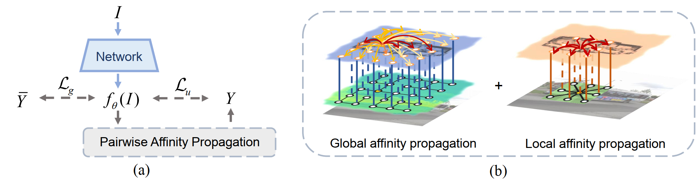
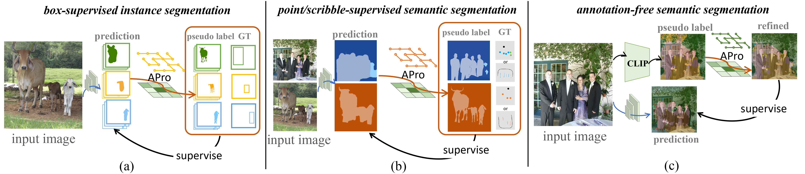
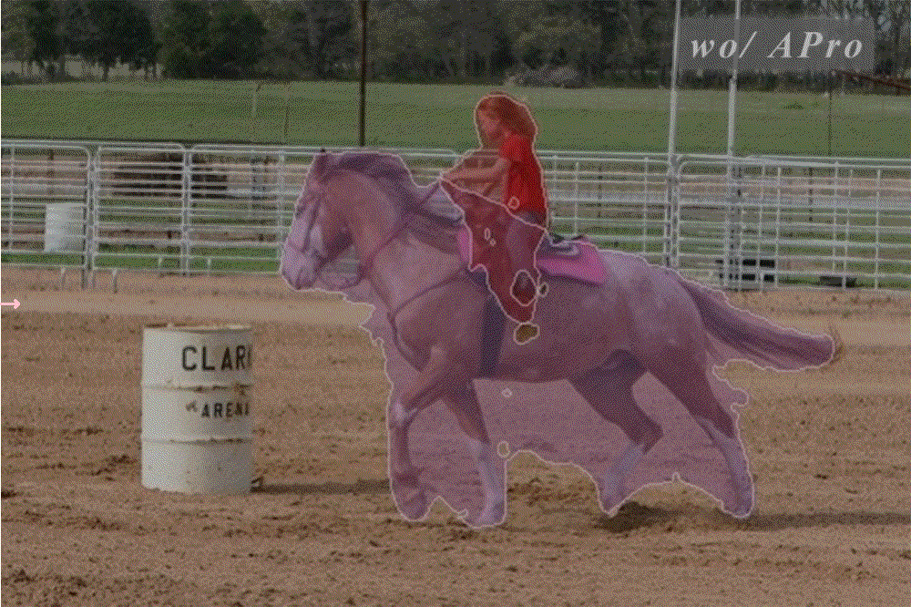
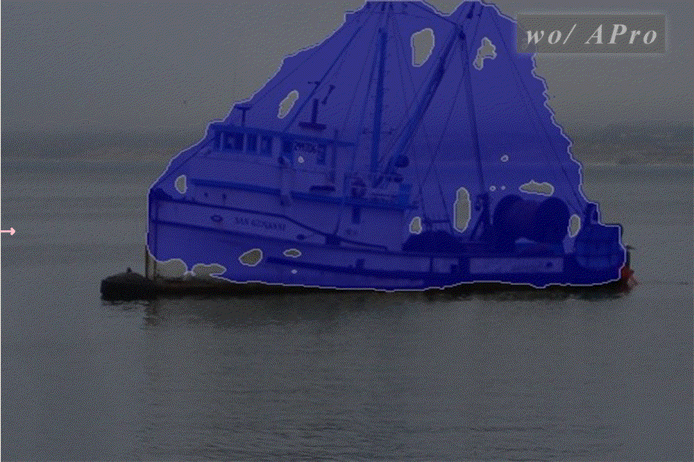
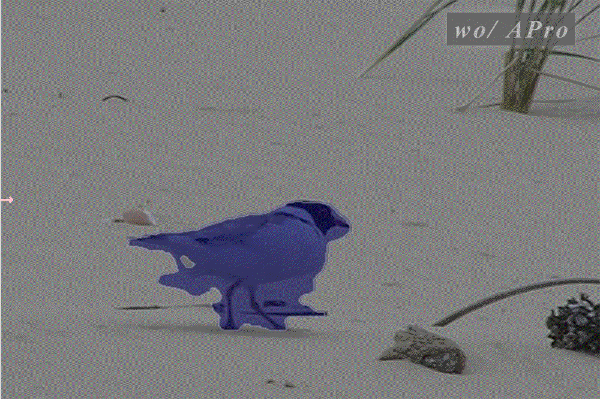
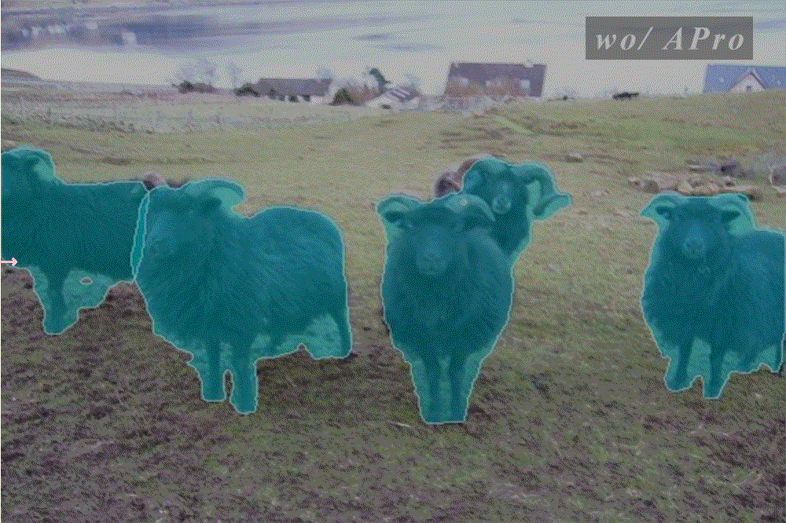
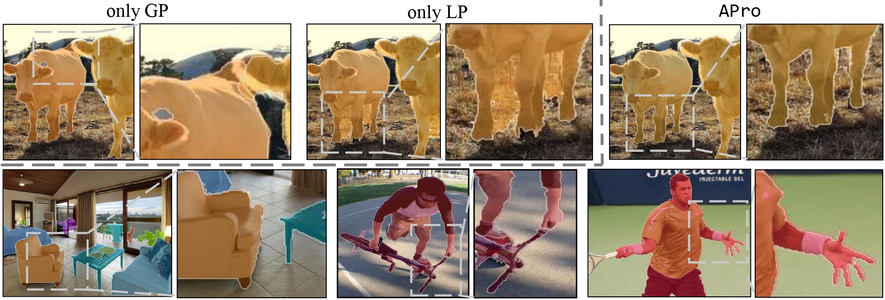
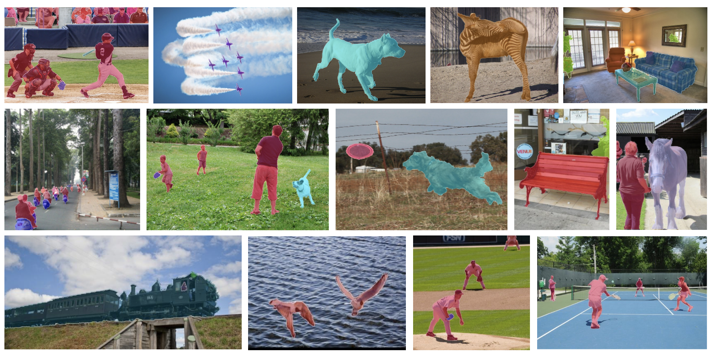

# Label-efficient Segmentation via Affinity Propagation
> [Wentong Li*](https://cslwt.github.io/), [Yuqian Yuan*](https://yuqianyuan.github.io/), [Song Wang](https://songw-zju.github.io/), [Wenyu Liu](https://scholar.google.com/citations?user=JloV4T0AAAAJ&hl=zh-CN), Dongqi Tang, Jian Liu, [Jianke Zhu](https://person.zju.edu.cn/jkzhu), and [Lei Zhang](https://www4.comp.polyu.edu.hk/~cslzhang/)
>
> **[Paper](https://arxiv.org/pdf/2310.10533.pdf) | NeurIPS2023**
>
> **[Project Homepage](https://LiWentomng.github.io/apro/)** 




## Introduction
We propose a method named **APro**, designed to generate precise soft pseudo labels online for unlabeled regions within segmentation networks.

This branch focuses on the task of **Weakly box-supervised Instance Segmentation** and is built upon the SOLOv2 and Mask2former frameworks, adhering to the [BoxInstSeg](https://github.com/LiWentomng/BoxInstSeg/tree/main) repository guidelines. Multiple instance segmentation experiments are reproduced to verify the effectiveness of our **APro** method on Pascal VOC and COCO. 

🌟Our **APro** method includes **global affinity propagation** and **local affinity propagation**. The
code can be found in `apro`, the usage of **APro** can be found below.

💡Our **APro** method can be seamlessly plugged into the existing segmentation networks for various tasks to achieve the weakly-supervised segmentation with label-efficient sparse annotations.




## Visual comparison w/wo APro
<table>
  <tr>
    <td></td>
    <td></td>
    <td></td>
  </tr>
  <tr>
    <td></td>
    <td></td>
    <td></td>
  </tr>
</table>


## Installation and Getting Started
This is built on the MMdetection (V2.25.0). Please refer to [Installation](./docs/install.md) and [Getting Started](./docs/get_started.md) for the details of installation and basic usage. We also recommend the user to refer the office introduction of MMdetection.

## Usage of APro


First, compile `gp_cuda` op  for the global affinity propagation.
```sh
cd apro/gp_cuda
python setup.py build develop
```

Then, import global&local affinity propagation and MinimumSpanningTree from `apro.apro`. 

```python
from apro.apro import Global_APro, Local_APro
from apro.gp_cuda.mst.mst import MinimumSpanningTree

global_apro = Global_APro()
local_apro = Local_APro(kernel_size=5, zeta_s=0.15) #set kernel_size and zeta_s
mst = MinimumSpanningTree(Global_APro.norm2_distance)
```

### Usage of GP (Global Affinity Propagation)
First, build a minimum spanning tree based on the input image.

```python
img_mst_tree = mst(image)
```
Then, call the function `global_apro` can get the soft_pseudo.

```python
soft_pseudo = global_apro(mask_pred, image, img_mst_tree, sigma=0.01)
```

You can also use the deep feature `feat`.

```python
soft_pseudo = global_apro(soft_pseudo, feat, img_mst_tree, sigma=0.07)
```
The loss for global one can be calculated, taking box supervision as example:

```python
loss_global_term = torch.abs(soft_pseudo - mask_pred) * box_mask_target
box_regions = box_mask_target.sum((1, 2, 3)).clamp(min=1)
loss_global_term = loss_global_term.sum((1, 2, 3)) / box_regions

loss_global = loss_global_term
```
### Usage of LP (Local Affinity Propagation)

```python

soft_pseudo = local_apro(image, mask_pred.squeeze(dim=1), box_mask_target.squeeze(dim=1))
```
The loss for global one can be calculated, box supervised as example:
```python
loss_local_term = torch.abs(mask_pred - soft_pseudo.unsqueeze(dim=1)) * box_mask_target
loss_local_term = loss_local_term.sum((1, 2, 3)) / box_regions
loss_local = loss_local_term
```

## Model Zoo

### 1.SOLOv2 Framework 
#### Pascal VOC
|  Backbone  | Epoch | Models | AP | AP50 | AP75 | 
|:----:|:----:|:----:|:----:|:-----:|:-----:|
| ResNet-50  |     36      | [model](https://huggingface.co/CircleRadon/APro/resolve/main/solov2_checkpoint/solov2_voc_r50_36epoch.pth)  | 38.4 | 65.4  | 39.8  | 
| ResNet-101 |     36      | [model](https://huggingface.co/CircleRadon/APro/resolve/main/solov2_checkpoint/solov2_voc_r101_36epoch.pth)  | 40.5 | 67.9 | 42.6 |

#### COCO 

|  Backbone  | Epoch | Models | AP | AP50 | AP75 | 
|:----:|:----:|:----:|:----:|:-----:|:-----:|
| ResNet-50  |     36      | [model](https://huggingface.co/CircleRadon/APro/resolve/main/solov2_checkpoint/solov2_coco_r50_36epoch.pth)  | 32.9 | 55.2  | 33.6  | 
| ResNet-101 |     36      | [model](https://huggingface.co/CircleRadon/APro/resolve/main/solov2_checkpoint/solov2_coco_r101_36epoch.pth)  | 34.3 | 57.0  | 35.3  |

### 2.Mask2Former Framework 
#### Pascal VOC
|  Backbone  | Epoch | Models | AP | AP50 | AP75 | 
|:----:|:----:|:----:|:----:|:-----:|:-----:|
| ResNet-50  |     50      | [model](https://huggingface.co/CircleRadon/APro/resolve/main/mask2former_checkpoint/mask2former_voc_r50_50epoch.pth)  | 42.3 | 70.6  | 44.5  | 
| ResNet-101 |     50      | [model](https://huggingface.co/CircleRadon/APro/resolve/main/mask2former_checkpoint/mask2former_voc_r101_50epoch.pth)  | 43.6 | 72.0  | 45.7  |
| Swin-L     |     50      | [model](https://huggingface.co/CircleRadon/APro/resolve/main/mask2former_checkpoint/mask2former_voc_swinl_50epoch.pth)  | 49.6 | 77.6  | 53.1  |

#### COCO 
|  Backbone  | Epoch | Models | AP | AP50 | AP75 | 
|:----:|:----:|:----:|:----:|:-----:|:-----:|
| ResNet-50  |     50      | [model](https://huggingface.co/CircleRadon/APro/resolve/main/mask2former_checkpoint/mask2former_coco_r50_50epoch.pth)  | 36.1 | 62.0  | 36.7  | 
| ResNet-101 |     50      | [model](https://huggingface.co/CircleRadon/APro/resolve/main/mask2former_checkpoint/mask2former_coco_r101_50epoch.pth)  | 38.0 | 63.6  | 38.7  |
| Swin-L     |     50      | [model](https://huggingface.co/CircleRadon/APro/resolve/main/mask2former_checkpoint/mask2former_coco_swinl_50epoch.pth)  | 41.0 | 68.3  | 41.9  |

## Visualization examples
### Visualization of different pairwise affinity terms



### Visualization of APro on COCO with ResNet-101 under the SOLOv2 framework



## Acknowledgement
This branch is built based on [BoxInstSeg](https://github.com/LiWentomng/BoxInstSeg) and [MMdetection](https://github.com/open-mmlab/mmdetection).

## Citation

```BibTeX
@inproceedings{APro,
  title={Label-efficient Segmentation via Affinity Propagation},
  author={Wentong Li, Yuqian Yuan, Song Wang, Wenyu Liu, Dongqi Tang, Jian Liu, Jianke Zhu and Lei Zhang},
  booktitle={Thirty-seventh Conference on Neural Information Processing Systems},
  year={2023}
}
```


## TODO
- [ ] 🔥Release the branch of weakly-supervised semantic segmentation.
- [ ] 🔥Release the branch of CLIP-guided Semantic Segmentation.
